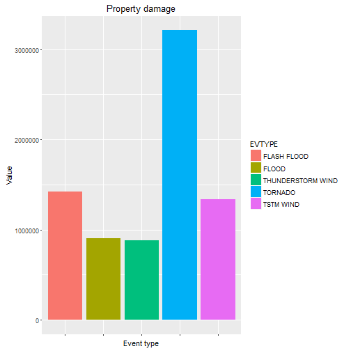
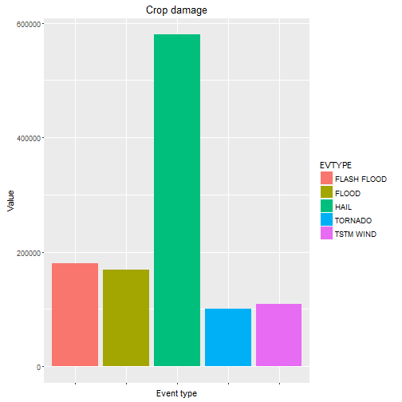

## Synopsis
This report summarizes analysis of impact of severe weather conditions on public
health and property damage caused by severe weather conditions.

The obtained  results suggest, that Tornadoes are the most severe types of weather events in terms of both impact on public health and property damage. The details of research methodology and results can be found in the following section of this report.

The analysis is based on U.S. National Oceanic and Atmospheric Administration's (NOAA) storm database, as of November 2011.

The dataset is available for [download](https://d396qusza40orc.cloudfront.net/repdata%2Fdata%2FStormData.csv.bz2). 

Complete [documentation](https://d396qusza40orc.cloudfront.net/repdata%2Fpeer2_doc%2Fpd01016005curr.pdf) for the research dataset is published and available for download.

As described in documentation, the dataset contains detailed records of:

- Storms and other significant weather phenomena, having sufficient intensity to cause loss of life, injuries, significant property damage, and/or disruption to commerce;

- Rare, unusual, weather phenomena that generate media attention, such as snow flurries in South Florida or the San Diego coastal area; and

- Other significant meteorological events, such as record maximum or minimum temperatures or precipitation that occur in connection with another event. 

## Loading raw data
Compressed data set is downloaded and read into data frame object. For improved performance, data data is being prevented from downloading if already present in the working directory. Decompressed data is stored in working directory as RDat file, to be loaded into memory as needed. 


```r
if (!dir.exists("./data/")) {

    dir.create("./data/")
    # Downloading data and documentation
    surl <- "https://d396qusza40orc.cloudfront.net/repdata%2Fdata%2FStormData.csv.bz2"
    durl <- "https://d396qusza40orc.cloudfront.net/repdata%2Fpeer2_doc%2Fpd01016005curr.pdf"
    furl <- "https://d396qusza40orc.cloudfront.net/repdata%2Fpeer2_doc%2FNCDC%20Storm%20Events-FAQ%20Page.pdf"

    download.file(surl, "./data/storm.bz2", mode="wb")
    download.file(durl, "./data/data_doc.pdf", mode="wb")
    download.file(furl, "./data/data_faq.pdf", mode="wb")

    # Read compressed file into data frame
    # read.csv function will decompress bz2 archive

    storm <- read.csv("./data/storm.bz2")

    # Save decompressed data set to RDat. file for reuse.
    save(storm, file="./data/storm.RDat")
}

# Load storm data from RDat. file if not present in memory
if(!exists("storm")) 
    load("./data/storm.RDat")
```
## Data description

The analysis set contains severe weather events, recorded between the year 1950 and November 2011. The Storm database contains 902297 rows and 37 columns. The colums used for analysis are listed in the table below.

| Column name 	| Type    	                    | Description      	|
|-------------	|------------------                 |------------------	|
| EVTYPE      	| Factor: 985 levels  | Type of weather event          |
| FATALITIES  	| Numeric      	                    | Number of fatalities per event |
| INJURIES     	| Numeric    	                    | Number of casualties per event |
| PROPDMG       | Numeric                           | Value of property damage per event |
| CROPDMG      	| Numeric                           | Value of crop damage per event |

Table: Description of selected variables

Since there are 72 levels of EVTYPE varialbe, the output  of the analysis must be limited to be readable. Therefore only top 20 most severe categories will be reported.

## Research methodology
This section describes assumptions made in the analysis.

### Severity of health impact
In order to measure impact of severe weather conditions on both population health and property damage, some measures must be established. Since both fatalities and injuries can be considered harmfull in regard to public health, those two variables should be included. 

However, in the assessment of severity of extrene weather confition in regard to pulic health, fatalities and injuries should not be included with the same weights. For purpouse of this analysis, arbitraty weight of 20% is assumed, i.e. one fatality corresponds to five fatalities in assesing the event severity. Finally, a "CASUALTIES" measure is calculated as follows:
```
CASUALTIES = FATALITIES+.2*INJURIES
```

In addition, it might be informative, to calculate number of casualties per event to measure how destructive is each type of events.

### Severity of economic impact
In order to calculate severity of extreme weather event in terms of economic impact impact, both property damage and crop losses should be taken into account. Since crop damage and property damage are two different categories, they will be analyzed separately, without attempting to aggregate the totals, as in case of health impact.

The rationale behind this approach is that crop damage can be extensive in overall damage, but relatively small in monetary terms. 

## Data transformations
In order to obtain severity measures calculated as described in the previous sections, the **dplyr** package is used.
The analysis also makes use of **tidyr**, for data transposition from vertical to horizontal format, required by barlopt routines in **ggplot2** library. Tables in this report are produced with **knitr:kable** function.
Firstly, the measures of health impact are calculated. The results are arranged in regard to casualties count.


```
## Error in library(tidyr): there is no package called 'tidyr'
```


```r
# Calculation of casualty value as fatalities + 0.2*injuries (arbitrary)
storm_cas <- storm %>%
    mutate(casualties = FATALITIES + 0.2*INJURIES
           , casualties=ceiling(casualties)
           )

# Calculating casualty values by event type
cas_evtype <- storm_cas %>%
    group_by(EVTYPE) %>%
    summarise(cas_sum = sum(casualties)
              , fat_sum = sum(FATALITIES)
              , inj_sum = sum(INJURIES)
              , ev_n = n()
              , cas_per_event = cas_sum/n()) %>%
    arrange(desc(cas_sum)) 
```
In order to draw barplot, comparing fatalities and injuries for each type of event, data need to be transposed with **tidyr** package function **gather**. 


```r
# Transform data to horizontal format to produce barplot
cas_bar <- head(cas_evtype,5) %>% 
  rename(Casualties=cas_sum, Fatalities=fat_sum, Injuries=inj_sum) %>%
  select(-c(ev_n, cas_per_event)) %>%
  gather(Label, value, -EVTYPE)
```

```
## Error in function_list[[k]](value): could not find function "gather"
```

The property and crop damage will be calculated in the similar fashion, as shown in the following code listing.


```r
storm_dmg <- storm %>% mutate(total_dmg = PROPDMG+CROPDMG)

dmg_evtype <- storm_dmg %>%
  group_by(EVTYPE) %>%
  summarise(total_dmg_sum = sum(total_dmg)
            , prop_dmg_sum = sum(PROPDMG)
            , crop_dmg_sum = sum(CROPDMG)
            , ev_n = n()
            , exp_dmg = total_dmg_sum/ev_n
            )
```
## Assessment of impact on public health 
The top 20 most severe types of weather events in respect to public health are listed in the following table. :

Printed with knirt:kable function to transform r output into markdown table.

```r
# suppress scientific notation in printed output
options(scipen=999)
cas <- head(cas_evtype, 20) 
names(cas) <- c("Event type", "Total casualties", "Total Fatalities", "Total injuries"
    , "Number of events", "Casualty rate")
kable(cas,  digits=2, caption = "Top 20 event types most severe to public health")
```


|Event type         | Total casualties| Total Fatalities| Total injuries| Number of events| Casualty rate|
|:------------------|----------------:|----------------:|--------------:|----------------:|-------------:|
|TORNADO            |            27902|             5633|          91346|            60652|          0.46|
|LIGHTNING          |             3836|              816|           5230|            15754|          0.24|
|TSTM WIND          |             3605|              504|           6957|           219940|          0.02|
|EXCESSIVE HEAT     |             3270|             1903|           6525|             1678|          1.95|
|FLOOD              |             1904|              470|           6789|            25326|          0.08|
|FLASH FLOOD        |             1560|              978|           1777|            54277|          0.03|
|HEAT               |             1372|              937|           2100|              767|          1.79|
|THUNDERSTORM WIND  |              840|              133|           1488|            82563|          0.01|
|HIGH WIND          |              737|              248|           1137|            20212|          0.04|
|WINTER STORM       |              542|              206|           1321|            11433|          0.05|
|ICE STORM          |              518|               89|           1975|             2006|          0.26|
|RIP CURRENT        |              495|              368|            232|              470|          1.05|
|THUNDERSTORM WINDS |              454|               64|            908|            20843|          0.02|
|HAIL               |              451|               15|           1361|           288661|          0.00|
|HEAVY SNOW         |              393|              127|           1021|            15708|          0.03|
|WILDFIRE           |              361|               75|            911|             2761|          0.13|
|AVALANCHE          |              335|              224|            170|              386|          0.87|
|HURRICANE/TYPHOON  |              324|               64|           1275|               88|          3.68|
|RIP CURRENTS       |              316|              204|            297|              304|          1.04|
|BLIZZARD           |              284|              101|            805|             2719|          0.10|

Based on the gathered data, it appears, that Tornadoes are leading cause of casualties in the USA, resulting in overall 27902 fatalities, and 5633 injuries. The calculated casualties amounted to 91346. It is interesting to note however, that although Tornadoes results in highest number of casualties, the actual casualty rate is modest 0.4600343. High position of Tornadoes result from high number of this type of events.  

Interestingly, the most destructive event types, such as HURRICANE/TYPHOON (3.68 casualty rate), Heat and Excessive Heat (1.95 and 1.79 respectively) has relatively low impact on public health, because of their low frequency of occurrence.

Finally, the results can be graphically presented in form of bar plot, created with **ggplot2** package.

```r
ggplot(cas_bar, aes(x=EVTYPE, y=value,fill=Label)) +
  labs(x="Event type", y="Sum", title="Severity of event type (Public Health)") + 
  geom_bar(stat="identity", position="dodge")
```

```
## Error in ggplot(cas_bar, aes(x = EVTYPE, y = value, fill = Label)): object 'cas_bar' not found
```

## Assessment of property impact
The economic impact of severe weather conditions are measured both in terms of property damage as well as crop damage. 
In order to produce meaningful output, the aggregate damage values are arranged and then printed in form of tables.  


```r
# arrange output by property/crop damage
dmg_prop <- arrange(dmg_evtype, desc(prop_dmg_sum))
dmg_crop <- arrange(dmg_evtype, desc(crop_dmg_sum))

top_prop <- head(dmg_prop, 10)
top_crop <- head(dmg_crop, 10)

# Apply proper names to output tables
nms <- c("Event type", "Total damage", "Property damage", "Crop damage"
                     , "Number of events", "Total damage per event")
  
names(top_prop) <- nms
names(top_crop) <- nms
```

The following table summarize the 10 most severe event types in terms of property damage. It can be noted, that Tornadoes are causing most property damage, aside from having the most serious impact on public health as discussed in previous paragraphs.

```r
kable(top_prop,  digits=2, caption = "Top 10 event types causing most property damage")
```


|Event type         | Total damage| Property damage| Crop damage| Number of events| Total damage per event|
|:------------------|------------:|---------------:|-----------:|----------------:|----------------------:|
|TORNADO            |    3312276.7|       3212258.2|   100018.52|            60652|                  54.61|
|FLASH FLOOD        |    1599325.1|       1420124.6|   179200.46|            54277|                  29.47|
|TSTM WIND          |    1445168.2|       1335965.6|   109202.60|           219940|                   6.57|
|FLOOD              |    1067976.4|        899938.5|   168037.88|            25326|                  42.17|
|THUNDERSTORM WIND  |     943635.6|        876844.2|    66791.45|            82563|                  11.43|
|HAIL               |    1268289.7|        688693.4|   579596.28|           288661|                   4.39|
|LIGHTNING          |     606932.4|        603351.8|     3580.61|            15754|                  38.53|
|THUNDERSTORM WINDS |     464978.1|        446293.2|    18684.93|            20843|                  22.31|
|HIGH WIND          |     342014.8|        324731.6|    17283.21|            20212|                  16.92|
|WINTER STORM       |     134699.6|        132720.6|     1978.99|            11433|                  11.78|

The following barplot displays following 4 types of events with highest property damage values. 


```r
ggplot(head(dmg_prop, 5), aes(x=EVTYPE, y=prop_dmg_sum, fill=EVTYPE)) + 
  labs(x="Event type", y="Value", title="Property damage") + 
  geom_bar(stat="identity", position="dodge") + 
  theme(axis.text.x=element_blank())
```



Similarly, the crop damage, can be summarized in the following table and barplot. Apparently, Hail is causing the highest crop damage. It is noteworthy however, that Tornadoes is among top 5 event types.


```r
kable(top_crop,  digits=2, caption = "Top 10 event types causing most crop damage")
```


|Event type         | Total damage| Property damage| Crop damage| Number of events| Total damage per event|
|:------------------|------------:|---------------:|-----------:|----------------:|----------------------:|
|HAIL               |   1268289.66|       688693.38|   579596.28|           288661|                   4.39|
|FLASH FLOOD        |   1599325.05|      1420124.59|   179200.46|            54277|                  29.47|
|FLOOD              |   1067976.36|       899938.48|   168037.88|            25326|                  42.17|
|TSTM WIND          |   1445168.21|      1335965.61|   109202.60|           219940|                   6.57|
|TORNADO            |   3312276.68|      3212258.16|   100018.52|            60652|                  54.61|
|THUNDERSTORM WIND  |    943635.62|       876844.17|    66791.45|            82563|                  11.43|
|DROUGHT            |     37997.67|         4099.05|    33898.62|             2488|                  15.27|
|THUNDERSTORM WINDS |    464978.11|       446293.18|    18684.93|            20843|                  22.31|
|HIGH WIND          |    342014.77|       324731.56|    17283.21|            20212|                  16.92|
|HEAVY RAIN         |     61964.94|        50842.14|    11122.80|            11723|                   5.29|


```r
ggplot(head(dmg_crop, 5), aes(x=EVTYPE, y=crop_dmg_sum, fill=EVTYPE)) + 
  labs(x="Event type", y="Value", title="Crop damage") + 
  geom_bar(stat="identity", position="dodge") + 
  theme(axis.text.x=element_blank())
```


